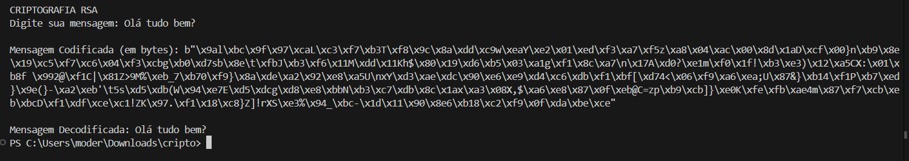

# 🔐 Criptografia RSA em Python

Este projeto implementa uma criptografia assimétrica usando o algoritmo **RSA**, com foco em proteger mensagens utilizando **chave pública e privada**. A biblioteca utilizada é `cryptography`.

---

## 🧠 Como funciona

- A **chave pública** é usada para **criptografar** (embaralhar) a mensagem.
- A **chave privada** é usada para **descriptografar** e recuperar a mensagem original.
- Isso garante que apenas quem possui a chave privada consiga ler a mensagem cifrada.

---

## ▶️ Como executar

1. Instale a biblioteca necessária:
   ```bash
   pip install cryptography
   ```

2. Rode o script principal:
   ```bash
   python rsa.py
   ```

---

## 🖼️ Imagem do Projeto

Abaixo está uma imagem do projeto rodando no VS Code:



---

## 📁 Arquivos

- `rsa.py` → Código principal da criptografia RSA  
- `img.png` → Imagem ilustrando a estrutura do projeto

---

## 📚 Observação

Este projeto foi desenvolvido para fins educacionais como parte de uma prova prática sobre **criptografia assimétrica**.
